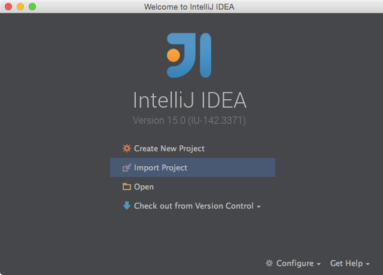

:spring_boot_version: 1.2.5.RELEASE
:jdk: http://www.oracle.com/technetwork/java/javase/downloads/index.html
:gs-maven: link:/guides/gs/maven
:gs-gradle: link:/guides/gs/gradle
:gs-consuming-rest: link:/guides/gs/consuming-rest
:toc:
:icons: font
:source-highlighter: prettify
:project_id: gs-sts
This guide walks you through using IntelliJ IDEA to build one of the Getting Started guides.

== What you'll build

You'll pick a Spring guide and import it into IntelliJ IDEA. Then you can read the guide, work on the code, and run the project.

== What you'll need

 - About 15 minutes
 - https://www.jetbrains.com/idea/download/[IntelliJ IDEA]
 - {jdk}[JDK 6] or later

== Installing IntelliJ IDEA
If you don't have IntelliJ IDEA installed yet, visit the link up above. From there, you can download a copy for your platform. To install  it simply
unpack the downloaded archive.

When you're done, go ahead and launch IntelliJ IDEA.

== Importing a Getting Started guide

With IntelliJ IDEA up and running, click **Import Project** on the **Welcome Screen**, or **File | Open** on the main menu:

In the pop-up dialog make sure to select either {gs-maven}[Maven]'s **pom.xml** or {gs-gradle}[Gradle]'s **build.gradle** file under the **complete** folder:

image::images/spring_guide_select_gradle_file.png[Select File or Directory to Import]

IntelliJ IDEA will create a project with all the code from the guide already entered.

In case you'd like to start with an empty project and copy-and-paste your way through the guide, create a new *Maven* or *Gradle* project in the *Project Wizard*:

